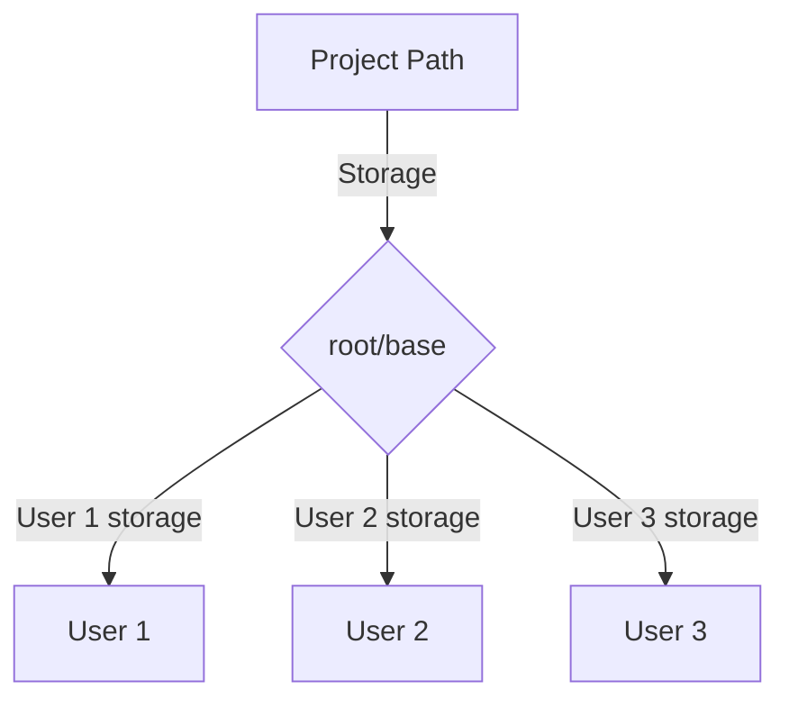

# Network Cloud Drive

Local network storage API that can store files and manage them. Uses SQLite for retrieving files and finding paths fast

[FEATURES](FEATURES.md)

### *Temporarily using HTTP Basic as authentication*

## Future plans
- React based Frontend for Desktop and iOS/Android phones
- Routinely syncing database with filesystem and a way to force a resync

## File Structure Visual

        
