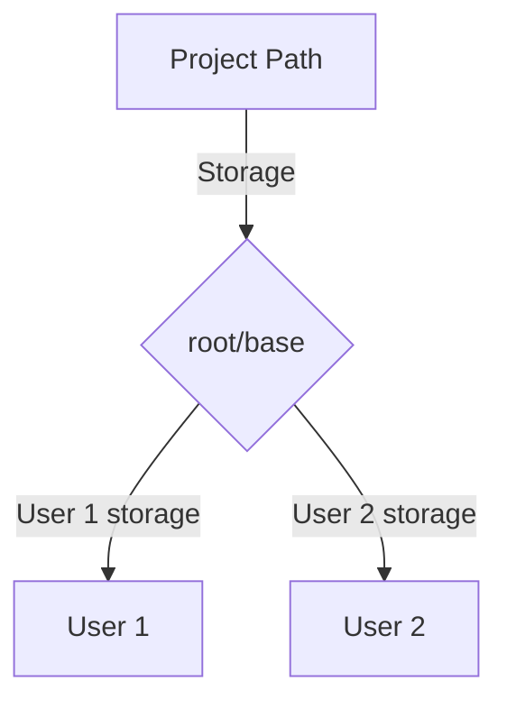

# Network Cloud Drive

Local network storage API that can store files and manage them. Uses SQLite for retrieving files and finding paths fast

## Current Capabilities

- Create folders and save its path
- Upload files
- Download files
- Get file/folder metadata
- Keeping database in sync with filesystem

## Future plans
- React based Frontend for Desktop and iOS/Android phones
- bug fixes
- Routinely syncing database with filesystem and a way to force a resync

## File Structure Visual

        
